# 🍇 O-D
> 사용자 맞춤 오디오북 서비스

## ✨ Key Features
- 사용자가 맞춤 커스터마이징 오디오북 성우 제공
- 사용률 감소에 따른 책 표지 생성
- 사용자 토론방 제공

## 📚 Contents
1. [👀 서비스 소개](#-서비스-소개)
2. [☃️ 서비스 플로우](#-☃️-서비스-플로우) 
3. [🌟 주요 기능](#-주요-기능)
4. [🛠️ 문제 및 해결](#-문제-및-해결)
5. [🏃🏻‍♀ 관련 링크](#-관련-링크)
6. [🎮 게임 플레이](#-게임-플레이)

## 🎄 서비스 소개
- 오디는 사용자 맞춤 오디오북 성우를 제공하는 서비스입니다.
- 커스터마이징 가능한 성우, 책표지 변경 외 다양한 기능을 제공합니다.

### 주제 선정 배경
> 최근 오디오북은 일상 속 쉽게 즐길 수 있는 수단이 되었으며, 이에따라 독서량 상승 효과를 가져왔습니다. 기존에 다양한 플랫폼이 존재하나 TTS 음성이 부자연스럽고, 성우가 직접 녹음한 오디오북은 제공하는 컨텐츠가 매우 한정적이라는 문제가 있었습니다. 증가하는 오디오북 수요에 맞춰 자연스러운 음성을 제공하고, 사용자가 원하는 음성으로 들을 수 있는 오디오북을 제공하고자 했습니다.

## ☃️ 서비스 플로우
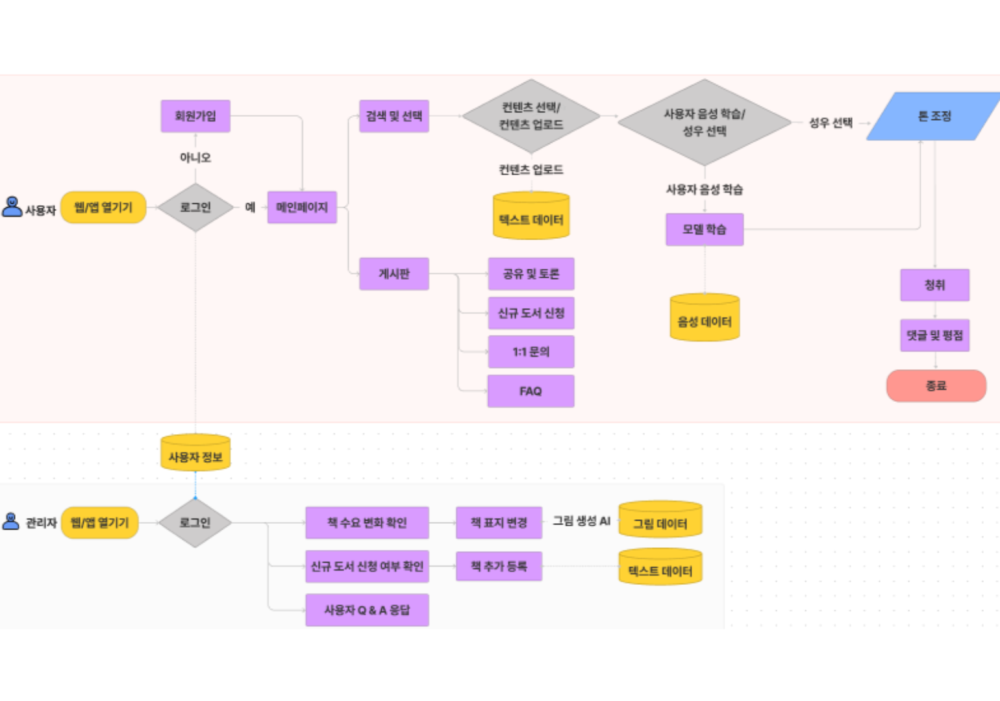

## 🌟 주요 기능

### 1. 커스텀 음성 생성
- 3분 이상의 음성 파일 선택
- 최대 1시간 이내의 성우 생성
- 커스텀 음성을 통한 책 청취
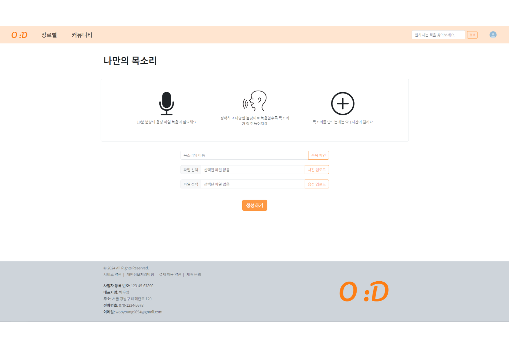
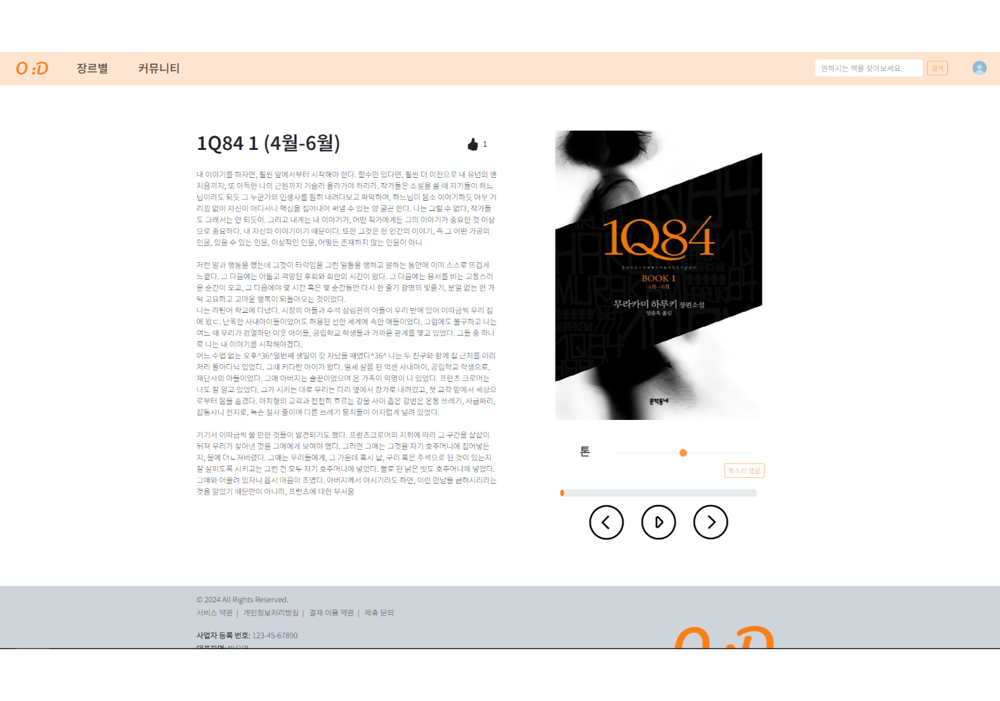

### 2. 새로운 컨텐츠 제공
- 사용자 추이 분석을 통한 책 표지 생성
- 테마 선택을 통한 표지 선택지 제공
- 도서 신청
  
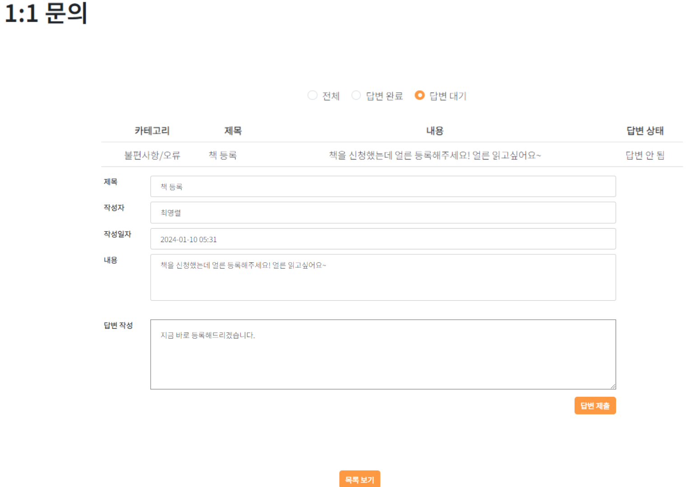

### 3. 도서 공유 및 토론
- 커뮤니티를 통한 독서 토론
- 이번주 TOP10 도서 추천
- 이번주 TOP10 성우/음성 추천
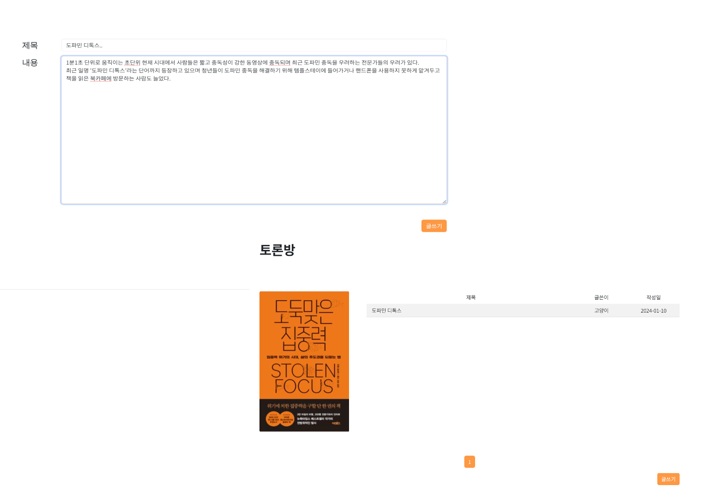
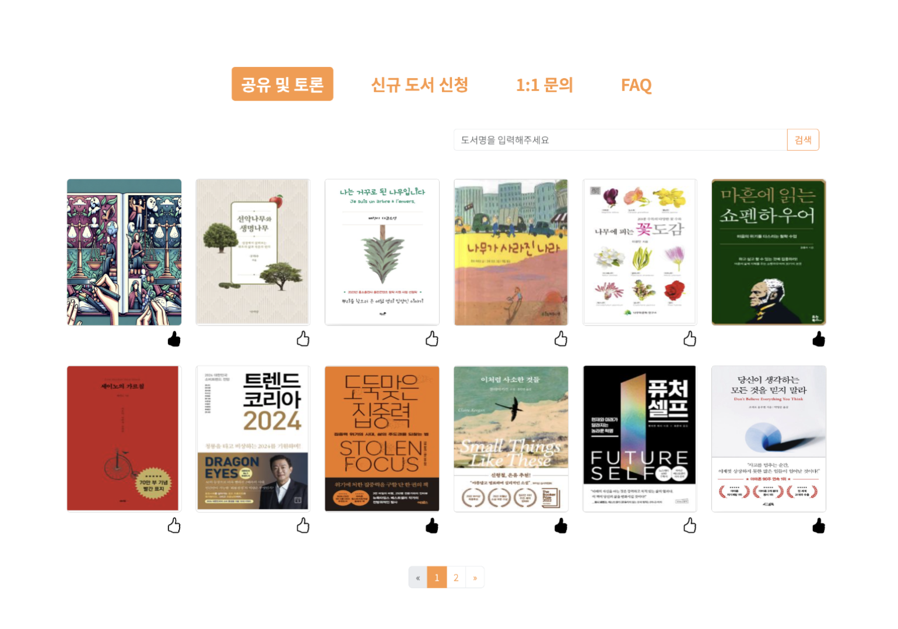

## 🛠️ 문제 및 해결
**AI모델링**  
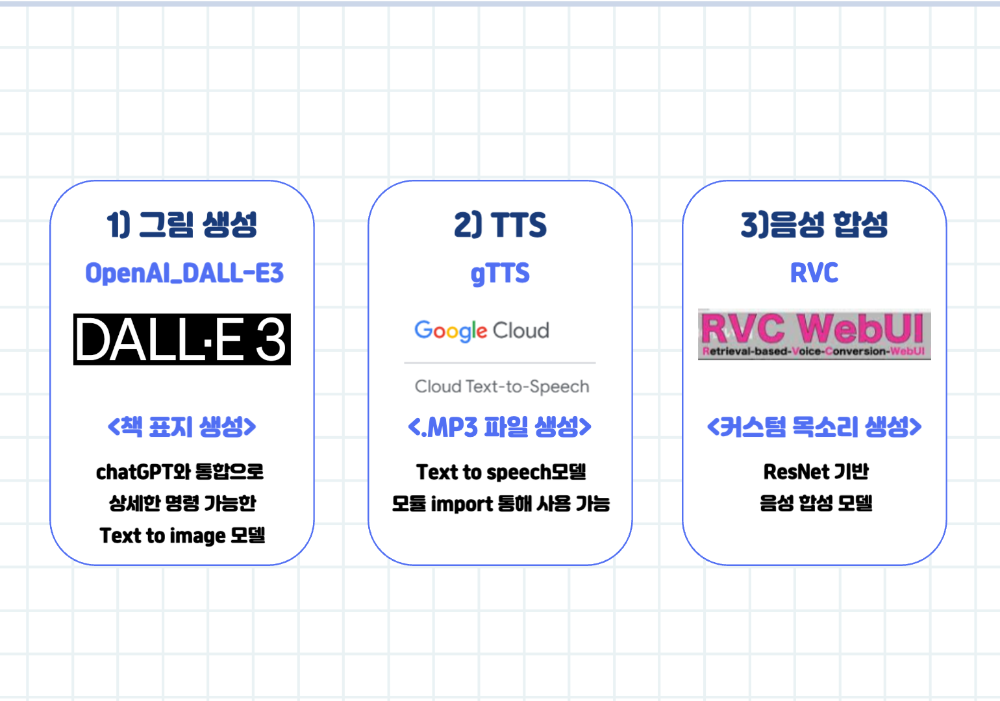
  
### 이미지 생성
- **Dall-E3 선택이유**  
  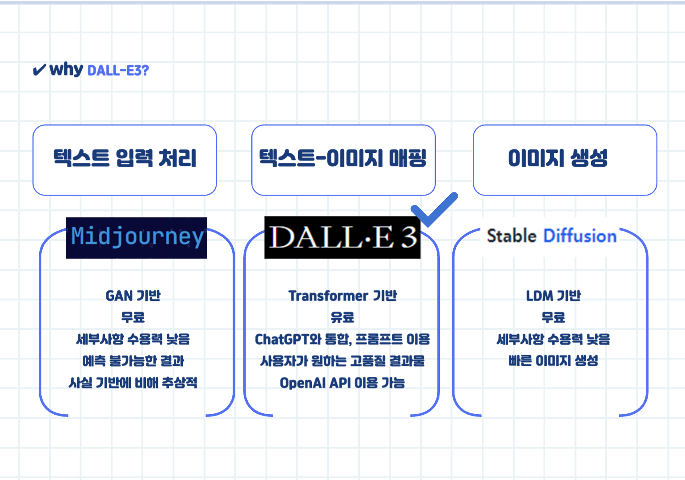

- **결과 고도화**  
  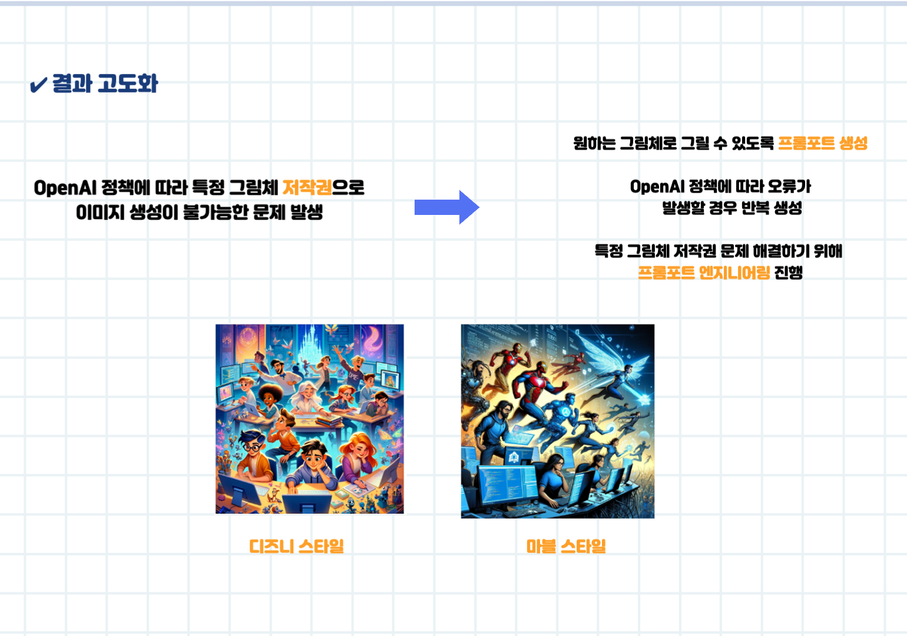

### 음성 생성
- **RVC선택이유**  
  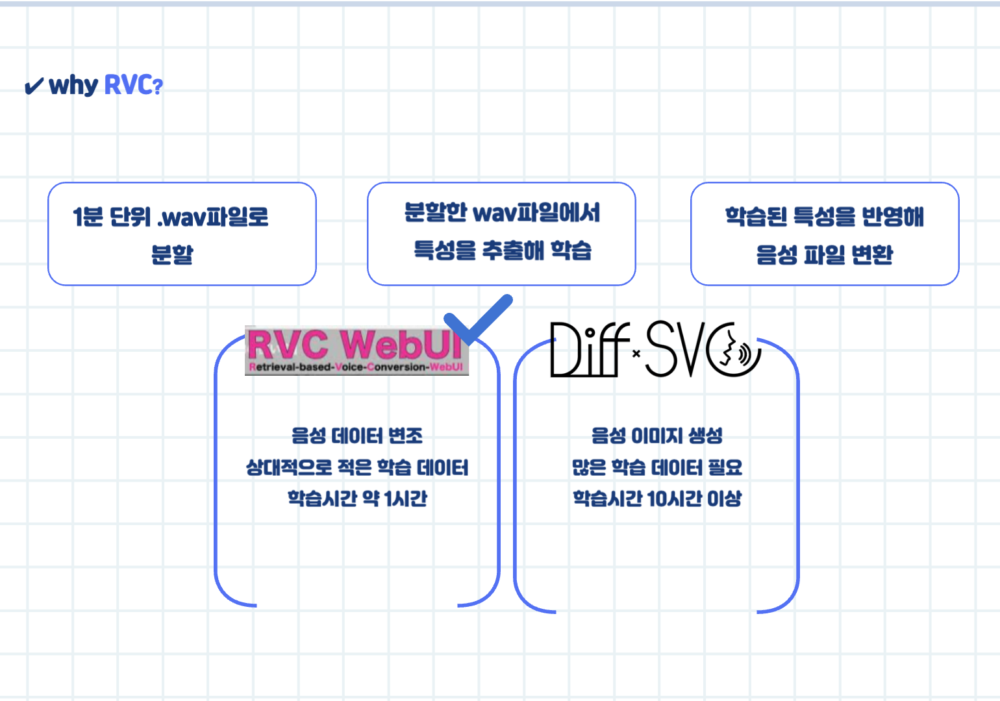
  
- **RVC플로우**
  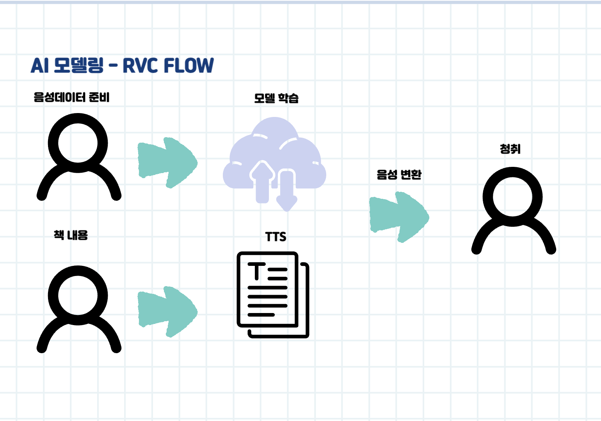
